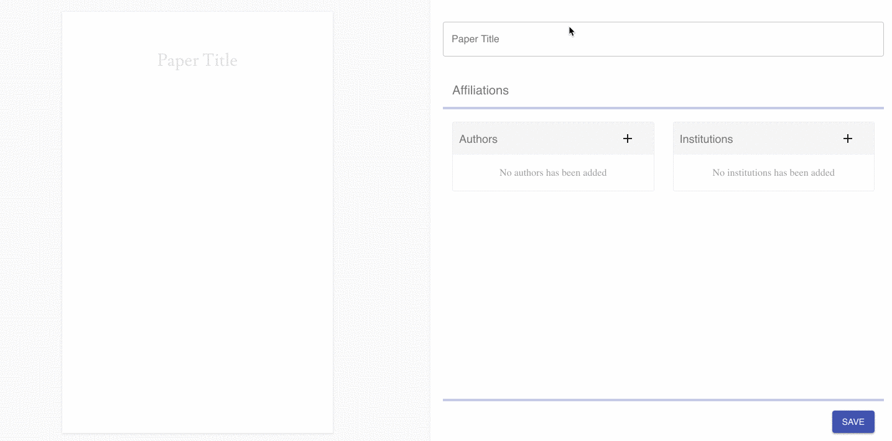

# Paper Cover Maker

A React application to create Papers covers.



- React
- React Router
- Express
- PostCSS
- Webpack

## Getting started
### Requirements
- Node 8
- Npm 5

### Local development

Execute the following commands to start a development server (nodemon):


```sh
npm install
npm run start:dev
```

### Production build

To build this project execute the script below:

```sh
npm run start:prod
```

The production version will minified and uglify the scripts to reduce the application bundle size.
